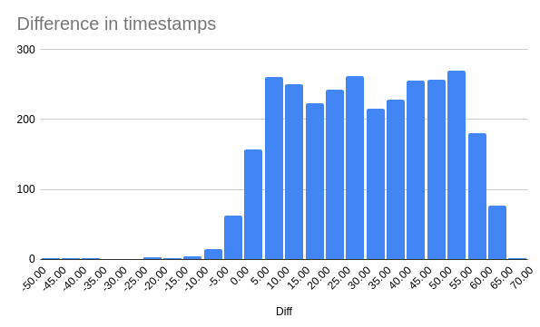

# FINAL ANALYSIS REPORT

This report tries to cover the points which are mentioned in the assignment like :

## Reporting

- Generate a reconciliation report summarizing matched and unmatched records.
- Highlight discrepancies and potential issues.

## Deliverables

- **Approach Document**: A detailed description of the approach used, including data preparation, matching techniques, and validation methods.
- **Code**: Python or R code implementing the reconciliation process.
- **Results**: Summary of the results, including the number of matched and unmatched records, and an analysis of discrepancies.

### Generate a reconciliation report summarizing matched and unmatched records

**Total records:**
| OPD  | PAYTM EDC |
|------|-----------|
| 6680 | 4652      |

**No. of records of **each mode of payments** in **OPD** Data Sheet:**
| Only Cash | Only Card | Only CHQ/Wallet | Cash+Card | Cash+CHQ/Wallet | Card+CHQ/Wallet | Cash+Card+CHQ/Wallet | Zero Bill | Total |
|-----------|-----------|-----------------|-----------|-----------------|-----------------|----------------------|-----------|-------|
| 0         | 2962      | 3440            | 12        | 53              | 0               | 0                    | 213       | **6680**  |

**No. of records of **each mode of payments** in **PAYTM EDC** Data Sheet:**
| Card        |            |
|-------------|------------|
| **Credit Card** | **Debit Card** |
| 3358        | 1294       |
| **Total**    | **4652**   |

- Point to note is that all the records in **PAYTM EDC** Data Sheet are of **Card** type.
- There are only **2974** records of **Card** type in **OPD** Data Sheet which includes both only card transactions and also cash+card transactions.
- Therefore we can **at-most match 2974** records between the two data sheets.
- We will look at the outliers and discrepancies in the data later.

#### Records matched beween OPD and PAYTM EDC using Direct Matching approach

- **Direct Matching** is a simple and straightforward approach that matches records based on a common unique identifier.
- In this case, we have **Bank_Transaction_ID** from **Paytm EDC** data sheet and **Payment Aggregator Transaction ID** from **OPD** data sheet are the common unique identifier between the two data sheets.
- We matched the records based on this common unique identifier and found that **2971** records are matched between the two data sheets.
- There were **3 records** which were **not matched** between the two data sheets even though they were card transactions.
- The reason being 3 records in **OPD** data sheet had **Payment Aggregator Transaction ID** as **NaN** and hence they were not matched with **Paytm EDC** data sheet. Usually all the transactions made by card will have a **Payment Aggregator Transaction ID** value but these 3 records didn't. 
- I suspect their might be some **discrepancy** while **saving the information** in the OPD software the have opted Card payment instead of UPI(CHQ/Wallet) or Cash Payment.
- These records **didn't match** even with the **fuzzy match technique** because we used a threshold of **90 seconds +/-** for matching the records on the basis of **Transaction Date and Time**.
- These records are **outliers** and we will look at them later. as these records are not present in **Paytm EDC** data sheet at all even after **manual inspection**.

#### Records matched beween OPD and PAYTM EDC using Fuzzy Matching approach

- As mentioned in the assignment pdf we can even use fuzzy matching techniques like Leveinstein distance, etc. to match the records between the two data sheets.
- I have used **thefuzz** library in python to match the records between the two data sheets, this library has implemented Leveinstein distance under the hood.
- Upon trying to match the records between the two data sheets using fuzzy matching approach, on rest of the unmatched records, i have tried different approches of **matching on the basis of Transaction Date and Time** with different **threshold** values.
- I have tried the following approaches:
  - 1. Matching on the basis of **Transaction Date and Time and Amount** with a threshold of **1.5 minute +/-**.
  - 2. Matching on the basis of **UnixTimestamp and Amount** with a threshold of **1.5 minutes +/-**.
- There is a **reason** for choosing **1.5 minutes** as the threshold value. I have looked at the matched records which are matched using direct matching technique, the difference in the transaction time in UnixTimestamp was ranging from -45 seconds to +65 seconds.
- The reason for having such a difference in the transaction time is that the **transaction time** in **OPD** data sheet is the time when the transaction is **initiated** and the **transaction time** in **Paytm EDC** data sheet is the time when the transaction is **completed**.
- Also the **resolution** of the **Transaction Time** in OPD is **1 minute** and in Paytm EDC is **1 second**. This might also be the reason for the difference in the transaction time.
- I think the **1.5 min threshold** is a **reasonable** value to match the records between the two data sheets, because we can assure a **30 seconds** as the **buffer** on top of the **observed trends** just so that we can include the outliers as well.

- Upon trying the above mentioned **Fuzzy Match approaches**, I have found that a further of **29 records** are matched between the two data sheets.
- These records include the trasactions which are made in card mode but actually saved as UPI(CHQ/Wallet) mode. This can be further verified by checking the **Comments** column of OPD sheet where this was mentioned for record with **Receipt #** :
  - **OPD/JNR/23-24/AD/RC/1067**
  - **OPD/JNR/23-24/CON/RC/51858**
  - **OPD/JNR/23-24/RC/22918**
  - these are just few of them, but there are in total of **7 records** of them which clearly mention, that these records are of **Card Type Transaction** but the payment was recorded under **CHQ/Wallet** mode.
- The rest of the **22 records** which are found using fuzzy matching also might be the same case but all of them are save under **UPI(CHQ/Wallet) Mode** but are not mentioned in the **Comments/Bank Vendor** column.

### Highlight discrepancies and potential issues

- The discrepancies which I found are that some of the records which are actually **Card payments** are recorded as **CHQ/Wallet payments**.
- Because of this management can have a hard time figuring out where the missing amounts gone?
- Like for eg:
  - The management can have **separate bank accounts** for **Card Type** payments and for **UPI payment** at the end of the month/year when they try to tally the total amount got from the different banks can be differed.
  - If management ignores this situation thinking that the money will be present in anyone of the bank account.
  - Then there can be a middle man who knows this loophole and try to steal the amount.

### Approach Document

#### Data Loading

- Used pandas library to load the data from the excel sheet

#### Data Cleaning

1. When inspected the data from the excel sheet, the OPD sheet had few empty rows in the starting.
2. Therefore we are suppose to drop those rows and reset the index and assign the column names.
3. Also there were plenty of unnecessary columns present in the OPD sheet so we had to drop them.
4. Detailed explanation is present in the jupyter notebook "**notebooks/dataExploration.ipynb**"
5. Also there were few columns in OPD sheet which are having Nan values we have to replace them with zero. Because when seen the data zero is the correct value instead of Nan value.
6. Coming to **Paytm EDC** sheet there are a lot of empty columns which are of no use, so we can drop those columns
7. Format the data as all the data loaded from Paytm EDC is having an extra ( **'** ) at the end.

#### Standardize Formats

1. Date time information in both the sheets are not in standardized format. so we have to format that
2. Also had to create few extra columns for the sake of fuzzy matching like for ex:
   - "(Unix Timestamp) + (Amount)"
   - "(Date Time) + (Amount)"
3. **Note** : All of them are in string format as Leveinstein distance is performed over strings.
4. Also made a column called **FinalAmount** because there is a chance that even CHQ/Wallet amount can be the final amount.
5. As per the data only one of them was non zero value so the Column had the sum of the two values from Card column and CHQ/Wallet column

> Saved the formatted datasets so far after cleaning to **data/processed/** folder for future analysis purpose.

#### Reconciliation

##### Direct Matching

- As the title says its direct matching, I have applied direct matching based on a unique identifier from both the sheets.
- The unique identifier which is **Bank_Transaction_ID** from **Paytm EDC** data sheet and **Payment Aggregator Transaction ID** from **OPD** data sheet.
- When there is a match we mark the "Matched" column as **True** else **False**.
- We will also try to check for any discrepancies like the amount of 2 records are matching / not matching.

##### Fuzzy Matching

- I have tried to apply fuzzy matching for a "UnixTimestampAmount" column of the row of the unmatched entry of PAYTM EDC. against the "UnixTimestampAmount" column of the OPD data sheet.
- I have used **Levenshtein Distance** to find the closest match.
- But the matches was not accurate at all
- Then i have tried different variations of the columns like "DateTimeAmount" of the 2 sheets.
- Still i didn't get expected results
- Then i tried apply the **Levenshtein Distance** over a smaller search space.
- Like looking only in the neighborhood **90 seconds +/-** of the **UnixTimestamp** column of both the sheets.
- This approach high quality matches.
- But there were only 29 records found using this approach.

#### Saving the results

- I have saved the results of the direct matching and fuzzy matching and unmatched records to **reports/reconciliation_report.csv** file.
